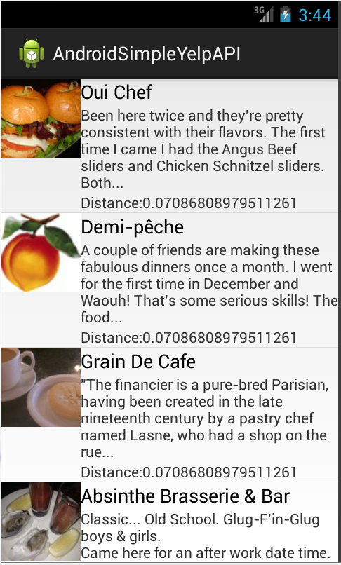

# Simple Yelp API Client for Android

## Sample Android App Screenshot

## Overview
Simple Yelp API Client for Android:
It is a skeleton Android project that makes writing Android apps that utilizes Yelp API version 2 as easy as possible. 
This skeleton project combines the libraries and structure to enable quick development of Yelp API clients or any Android mobile app that would like to integrate with Yelp API.

I created this project as a result of lack of detailed information regarding how to integrate Restful Yelp API to an Android app.
Most things I found on internet are quite dated or not simple enough IMO. Therefore, I hope this will help whoever that will need this for iterate their own apps quickly.

Hopefully, this would help you getting things up running quickly with a sample Android App.

# The following things are supported out of the box:
 * Authenticating with any OAuth 1.0a for Yelp API version 2
 * Sending a Yelp search requests for AND parsing a raw response JSON data from Yelp API called into a strongly-typed data object.
 * Customizable filter request to Yelp API.

# The following libraries are used to make this possible:
 * [scribe-java](https://github.com/fernandezpablo85/scribe-java) - Simple OAuth library for handling the authentication flow.
 * [Picasso](https://github.com/square/picasso) - A powerful image downloading and caching library for Android
 
# Author(s)/Contributor(s)
* [Nate Kemavaha](https://github.com/boyserk84/)

# Feedback, issue, concern or suggestion?
Please email me at [nkemavaha@gmail.com](mailto:nkemavaha@gmail.com).

